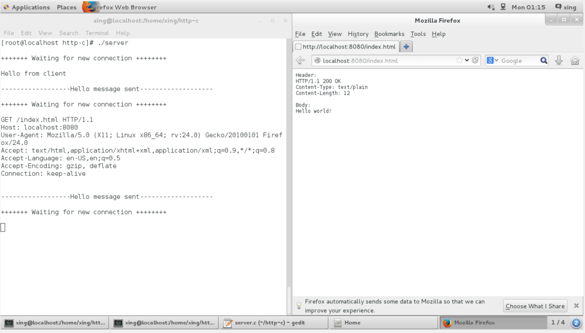

# httpServer

一個簡單的 httpServer

# 使用方式

在 linux 上用開啟兩個終端機，分別執行 client 和 server 執行檔

也可以在本機開一個網頁當作客戶端，連上 localhost 測試

# 說明

流程 :

  1. 建立 socket 連線    
  2. 綁定伺服器端的地址
  3. 監聽開放的 port
  4. 接收客戶端請求 
  5. 讀取資料
  6. 傳回資料給客戶端
  7. 關閉 socket 連線
  
## 伺服器端資訊

客戶端在連線的時候需要知道伺服器端的連線資訊


```
struct sockaddr_in address;
```

使用 `<netinet/in.h>` 裡定義的 `struct sockaddr_in` 結構來儲存資訊，包含了伺服器的 ip 和 port


定義伺服器的資訊:
```
address.sin_family = AF_INET;          
address.sin_addr.s_addr = INADDR_ANY;   
address.sin_port = htons( PORT );

memset(address.sin_zero, '\0', sizeof address.sin_zero);
```
#### sin_family

AF_INET 代表 ipv4 協定

#### sin_addr.s_addr

INADDR_ANY 表示任意地址，類似 0.0.0.0

#### sin_port

定義要被連線的 port

htons() 函數 => host to Network Short 把本機位址字節順序轉換為網路字節順序

參考 -- https://my.oschina.net/alphajay/blog/4277

#### sin_zero

sin_zero 是為了讓 sockaddr 和 sockaddr_in 兩個數據結構保持調小相同而保留的字節

參考 -- https://blog.csdn.net/li4850729/article/details/7673791

## 1. 建立連線

```
if ((server_fd = socket(AF_INET, SOCK_STREAM, 0)) == 0)
{
    perror("In socket");
    exit(EXIT_FAILURE);
}
```

## 2. 綁定地址

```
if (bind(server_fd, (struct sockaddr *)&address, sizeof(address))<0)
{
    perror("In bind");          // 傳回 'In bind 錯誤訊息'
    exit(EXIT_FAILURE);         // exit(-1) 非正常退出
}
```

## 3. 監聽 port

```
if (listen(server_fd, 10) < 0)  
{
    perror("In listen");
    exit(EXIT_FAILURE);
}
```

## 4. 接收請求

```
if ((new_socket = accept(server_fd, (struct sockaddr *)&address, (socklen_t*)&addrlen))<0)
{
    perror("In accept");
    exit(EXIT_FAILURE);
}
```

## 5. 讀取資料

```
char buffer[30000] = {0};
valread = read( new_socket , buffer, 30000);
```

## 6. 傳回資料

`write(new_socket , hello , strlen(hello));`

## 7. 關閉連線

`close(new_socket);`


參考 -- https://medium.com/from-the-scratch/http-server-what-do-you-need-to-know-to-build-a-simple-http-server-from-scratch-d1ef8945e4fa


# 使用

